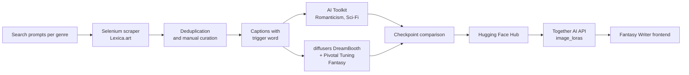

# Genre-Specific FLUX LoRA Fine-Tuning

Fantasy Writer AI illustrates each book in a visual style that matches its literary genre. To do that, three LoRA adapters were fine-tuned on top of **FLUX.1-dev**, one per genre: **Romanticism**, **Science-Fiction** and **Fantasy**. The adapters are published on Hugging Face and were tested through the Together AI API (see [Integration](#5-integration-in-fantasy-writer) for the current status in the app).

> **Author:** Wail Yacoubi
> **Training period:** May 23 – June 3, 2025
> **Hardware:** Lightning.ai Studio, NVIDIA L40S (48 GB VRAM)
>
> This documentation was written in October 2026 from the original training logs, configuration files and the metadata stored in the published `.safetensors` files. Every hyperparameter below comes from those sources. Where something could not be verified, it is stated explicitly.

## Published models

| Genre | Hugging Face repository | Trigger | Method | Size |
|---|---|---|---|---|
| Romanticism | [Wailyacoubi/romantic-style-flux-lora-final](https://huggingface.co/Wailyacoubi/romantic-style-flux-lora-final) | `romantic_style` | LoRA (AI Toolkit) | 687 MB |
| Science-Fiction | [Wailyacoubi/scifi-art-flux-lora](https://huggingface.co/Wailyacoubi/scifi-art-flux-lora) | `science_fiction_style` | LoRA (AI Toolkit) | 687 MB |
| Fantasy | [Wailyacoubi/fantasy-flux-lora](https://huggingface.co/Wailyacoubi/fantasy-flux-lora) | `<s0><s1>` (trained as `TOK`) | DreamBooth LoRA + Pivotal Tuning (diffusers) | 179 MB + 3 kB embeddings |

An intermediate Romanticism checkpoint (step 2,850) is also available at [Wailyacoubi/romantic-style-flux-lora](https://huggingface.co/Wailyacoubi/romantic-style-flux-lora). It was kept for comparison with the final model (see [Evaluation](#4-evaluation)).

## Pipeline overview



## 1. Dataset collection

### Scraper

Images were collected from [Lexica.art](https://lexica.art), a gallery of AI-generated images searchable by prompt. The scraper is [`Scraping/extract_images.py`](../Scraping/extract_images.py). It uses **Selenium** with Chrome to:

1. open the Lexica search page for each query;
2. wait for the result grid, then click each result in turn;
3. click the download button and wait for the download to finish;
4. close the image view and move to the next result.

It re-fetches the grid on every iteration to avoid stale DOM references, scrolls each element into view before clicking, adds random delays between actions, and refreshes the page when an element fails.

### Per-genre datasets

The same scraper was adapted for each genre by changing its search queries and the number of images per query.

| Genre | Search strategy | Raw images | Final dataset |
|---|---|---|---|
| Fantasy | 16 character-focused queries (wizard, knight, elven archer, paladin, vampire lord…) added to 7 scene queries (maps, battles, floating cities, creatures, artifacts) so that about 40% of the dataset shows characters | ~42 from the first pass, plus the character pass | **39 images** |
| Science-Fiction | 24 queries in 6 categories (cities, spacecraft, alien worlds, technology, cosmic phenomena, characters), 8 images each | 336 (each image was downloaded twice) | **53 images** after deduplication and curation |
| Romanticism | Queries targeting old oil paintings of the Romantic era (portraits, couples, sublime landscapes), excluding nudity, complemented by manual search | — | **~34 images**, hand-selected |

Curation rules applied to all three datasets: remove duplicates and low-quality images, keep a consistent style inside each dataset, and favor images with people, since book illustrations mostly show characters.

### Captions

Each image has a `.txt` caption with the same base name. Captions describe the subject and end with (or contain) the genre trigger word:

```text
a sublime romantic landscape with dramatic lighting and atmospheric perspective, romantic_style
a TOK character in epic fantasy art style
```

For Science-Fiction, the scraper also tried to save the original Lexica prompt as the caption. Lexica's page structure had changed, so prompt extraction failed and generic captions with the trigger word were used instead.

### Data not included

The scraped images are **not redistributed** in this repository. They come from a third-party website and remain subject to its terms. The scraper and the search queries are provided so the datasets can be rebuilt.

## 2. Training

Two approaches were used and compared.

| | Romanticism | Science-Fiction | Fantasy |
|---|---|---|---|
| Tool | [AI Toolkit](https://github.com/ostris/ai-toolkit) | AI Toolkit | [diffusers](https://github.com/huggingface/diffusers) `train_dreambooth_lora_flux_advanced.py` |
| Base model | FLUX.1-dev | FLUX.1-dev | FLUX.1-dev |
| LoRA rank / alpha | 64 / 64 | 64 / 64 | 32 |
| Target layers | All transformer layers (attention, MLP, norms) | All transformer layers | Attention + feed-forward of double blocks, Q/K/V of single blocks |
| Optimizer | AdamW 8-bit, EMA 0.99 | AdamW 8-bit, EMA 0.99 | AdamW, LoRA dropout 0.1 |
| Learning rate | 8e-5, cosine with restarts | 1e-5, cosine with restarts | 1e-4 (text encoder 5e-5), constant, 100 warmup steps |
| Batch size | 2 × gradient accumulation 2 | 2 | 2 × gradient accumulation 2 |
| Steps | 3,000 (42 epochs) | 2,500 (26 epochs) | 1,000 |
| Resolution | 512 / 768 / 1024 buckets | 512 / 768 / 1024 buckets | 1024 |
| Precision | bf16 training, fp16 weights | bf16 training, fp16 weights | bf16 |
| Text embeddings | Not trained | Not trained | Pivotal tuning: 2 new CLIP tokens, trained for the first 50% of steps |

### Romanticism and Science-Fiction (AI Toolkit)

Configuration used for the Romanticism run (`configs/romantic_style.yaml`):

```yaml
job: extension
config:
  name: romantic_style_lora
  process:
    - type: sd_trainer
      training_folder: output/romantic_style
      device: cuda:0
      trigger_word: romantic_style
      network:
        type: lora
        linear: 64
        linear_alpha: 64
      save:
        dtype: float16
        save_every: 150
        max_step_saves_to_keep: 15
      datasets:
        - folder_path: datasets/romantic_style
          caption_ext: txt
          caption_dropout_rate: 0.05
          shuffle_tokens: false
          cache_latents_to_disk: true
          resolution: [512, 768, 1024]
      train:
        batch_size: 2
        steps: 3000
        gradient_accumulation_steps: 2
        train_unet: true
        train_text_encoder: false
        gradient_checkpointing: true
        noise_scheduler: flowmatch
        optimizer: adamw8bit
        lr: 8e-5
        lr_scheduler: cosine_with_restarts
        ema_config:
          use_ema: true
          ema_decay: 0.99
        dtype: bf16
      model:
        name_or_path: black-forest-labs/FLUX.1-dev
        is_flux: true
        quantize: false
      sample:
        sampler: flowmatch
        sample_every: 150
        sample_steps: 25
        guidance_scale: 3.5
        width: 1024
        height: 1024
        prompts:
          - "a romantic landscape with dramatic lighting, romantic_style"
          - "a sublime mountain vista with golden hour lighting, romantic_style"
          - "a portrait in romantic period style, romantic_style"
          - "a gothic cathedral in misty atmosphere, romantic_style"
          - "a turbulent seascape with stormy clouds, romantic_style"
```

The Science-Fiction config (`configs/scifi_style.yaml`) is identical except for the name `scifi_art_lora`, the trigger `science_fiction_style`, `lr: 1e-5`, `gradient_accumulation_steps: 1`, `max_grad_norm: 1.0` and `save_every: 100`.

The Science-Fiction run was interrupted twice (at steps 1,445 and 2,100). Training was resumed from the latest checkpoint each time, and the target was reduced from 3,000 to 2,500 steps to finish within the available GPU time.

Run with:

```bash
cd ai-toolkit
python run.py ../fine-tuning/configs/romantic_style.yaml
```

### Fantasy (DreamBooth LoRA + Pivotal Tuning)

Fantasy used the advanced DreamBooth script from diffusers. Besides the LoRA weights, **pivotal tuning** learns new text-embedding vectors for the trigger: `TOK` is replaced by two new CLIP tokens, `<s0><s1>`, whose embeddings are optimized during the first half of training. This lets the trigger carry the style itself instead of relying on an existing word.

```bash
accelerate launch train_dreambooth_lora_flux_advanced.py \
  --pretrained_model_name_or_path="black-forest-labs/FLUX.1-dev" \
  --instance_data_dir="datasets/fantasy_style" \
  --instance_prompt="TOK epic fantasy art style" \
  --validation_prompt="a TOK epic wizard casting magical spells in an ancient tower, epic fantasy art" \
  --output_dir="fantasy-flux-lora-output" \
  --mixed_precision="bf16" \
  --resolution=1024 \
  --train_batch_size=2 \
  --gradient_accumulation_steps=2 \
  --gradient_checkpointing \
  --learning_rate=1e-4 \
  --text_encoder_lr=5e-5 \
  --optimizer="adamw" \
  --train_text_encoder_ti \
  --train_text_encoder_ti_frac=0.5 \
  --lr_scheduler="constant" \
  --lr_warmup_steps=100 \
  --max_train_steps=1000 \
  --rank=32 \
  --lora_dropout=0.1 \
  --checkpointing_steps=200 \
  --validation_epochs=25 \
  --num_validation_images=4 \
  --seed=42
```

A first run used `FANTASY` in the instance prompt while the script expected the `TOK` token abstraction. The script warned that the text embeddings would be optimized incorrectly, so the run was stopped, the prompt and all 39 captions were rewritten with `TOK`, and training was restarted.

### Why two approaches

| | AI Toolkit LoRA | DreamBooth + Pivotal Tuning |
|---|---|---|
| What is trained | LoRA on every transformer layer | Smaller LoRA + new token embeddings |
| File size | 687 MB | 179 MB + 3 kB |
| Trigger | Plain word (`romantic_style`) | Learned tokens (`<s0><s1>`) |
| Strength | Simple config, strong style transfer | Lighter adapter, trigger carries the style |
| Limitation | Large file | Embeddings must be loaded separately at inference |

## 3. Inference

### Romanticism and Science-Fiction

```python
import torch
from diffusers import FluxPipeline

pipe = FluxPipeline.from_pretrained(
    "black-forest-labs/FLUX.1-dev", torch_dtype=torch.bfloat16
)
pipe.enable_model_cpu_offload()
pipe.load_lora_weights(
    "Wailyacoubi/romantic-style-flux-lora-final",
    weight_name="romantic_style_lora.safetensors",
)

image = pipe(
    "a couple in a horse-drawn carriage at sunset, romantic_style",
    num_inference_steps=28,
    guidance_scale=3.5,
    height=1024,
    width=1024,
).images[0]
image.save("romantic.png")
```

The prompt must contain the exact trigger word (`romantic_style` or `science_fiction_style`) for the LoRA to activate fully.

### Fantasy (with pivotal-tuning embeddings)

`load_lora_weights` only loads the LoRA weights. The learned embeddings must be loaded separately, and the prompt must use `<s0><s1>` instead of `TOK`.

```python
import torch
from diffusers import FluxPipeline
from huggingface_hub import hf_hub_download
from safetensors.torch import load_file

repo = "Wailyacoubi/fantasy-flux-lora"
pipe = FluxPipeline.from_pretrained(
    "black-forest-labs/FLUX.1-dev", torch_dtype=torch.bfloat16
)
pipe.enable_model_cpu_offload()
pipe.load_lora_weights(repo, weight_name="pytorch_lora_weights.safetensors")

emb_path = hf_hub_download(repo, "fantasy-flux-lora-output_emb.safetensors")
state_dict = load_file(emb_path)
pipe.load_textual_inversion(
    state_dict["clip_l"],
    token=["<s0>", "<s1>"],
    text_encoder=pipe.text_encoder,
    tokenizer=pipe.tokenizer,
)

image = pipe(
    "a <s0><s1> elven archer in an enchanted forest, epic fantasy art",
    num_inference_steps=28,
    guidance_scale=3.5,
).images[0]
image.save("fantasy.png")
```

Use `torch.bfloat16`: FLUX in `float16` can produce black images.

## 4. Evaluation

Evaluation was qualitative, by comparing generations on fixed prompts and seeds.

- **Checkpoint selection (Romanticism).** The step-2,850 checkpoint and the final step-3,000 model were compared on the same prompts. The final model was kept: it produced richer textures, warmer colors and a stronger oil-painting look.
- **Cross-theme generalization (Fantasy).** The Fantasy LoRA was tested on a grid of 8 prompts covering four themes (sci-fi, romanticism, classical art, fantasy) to see how its style transfers to subjects outside its training set.
- **LoRA scale.** The app uses scales between 0.8 and 1.0. A systematic sweep (0.5 to 1.2) on fixed prompts is planned to choose the best value per genre.
- **Local vs. API.** Images generated through Together AI were noticeably weaker than local generations with the same prompt and step count, because the API does not expose the guidance scale and does not load the Fantasy embeddings (see [Limitations](#6-limitations)).

## 5. Integration in Fantasy Writer

**Current status:** the image generation code on the main branch (`Frontend/src/services/imageGenerationService.ts`) calls `black-forest-labs/FLUX.1-schnell-Free` without any LoRA. The genre LoRAs were tested against the Together AI API during development, but that integration was not merged into the app.

The tested request sends the genre's LoRA URL to the Together AI image endpoint:

```typescript
const payload = {
  model: "black-forest-labs/FLUX.1-dev-lora",
  prompt: `${scenePrompt}, romantic_style`,
  width: 1024,
  height: 1024,
  steps: 28,
  image_loras: [
    {
      path: "https://huggingface.co/Wailyacoubi/romantic-style-flux-lora-final/resolve/main/romantic_style_lora.safetensors",
      scale: 1.0,
    },
  ],
};
```

In the app, the scene prompt is produced by a Llama model that turns the selected book passage into a visual description. Merging the LoRA call means switching the model to `FLUX.1-dev-lora`, choosing the LoRA from the book's genre, and appending the genre trigger to that prompt.

## 6. Limitations

- **Pivotal-tuning embeddings are not used in production.** Together AI only loads LoRA weights through `image_loras`, so the Fantasy model runs without its learned `<s0><s1>` embeddings in the app. The style still applies through the LoRA weights, but part of what was learned is lost. Serving the model with diffusers would fix this.
- **Captions may have been ignored in the AI Toolkit runs.** The original configs stored captions in a separate `caption_folder`. The training metadata only records the trigger word, so it is possible that AI Toolkit trained on the trigger alone rather than on the full captions. The config in this repository keeps captions next to the images, which AI Toolkit reads reliably.
- **Small datasets.** 34 to 53 images per genre is enough to learn a style, but limits the variety of subjects the adapters handle well.
- **No quantitative metrics.** Checkpoints were compared visually. A next step would be to score generations with CLIP similarity against the style references and against the prompt.
- **Scraper fragility.** The scraper depends on Lexica's page structure, which changed during the project (prompt extraction stopped working). It also contains a timeout bug in `wait_for_download` that should be fixed before reuse.

## Running the comparison locally

`inference/generate.py` generates the same scene twice, with the same prompt and seed: once with the base FLUX.1-dev model and once with the genre LoRA, then saves a side-by-side comparison in `results/`. On GPUs with 40 GB or more it loads the model in full bf16 precision; on smaller GPUs (tested on an 8 GB RTX 5070 Laptop) it loads the transformer in 4-bit NF4 and the T5 encoder in 8-bit.

```bash
# 1. GPU build of PyTorch first (pick the CUDA version matching your driver)
python -m pip install torch torchvision --index-url https://download.pytorch.org/whl/cu128
# 2. Other dependencies
python -m pip install -r fine-tuning/inference/requirements.txt
# 3. Download the LoRAs (requires accepting the FLUX.1-dev license on Hugging Face)
hf auth login
hf download Wailyacoubi/romantic-style-flux-lora-final --local-dir fine-tuning/loras/romantic
hf download Wailyacoubi/scifi-art-flux-lora --local-dir fine-tuning/loras/scifi
hf download Wailyacoubi/fantasy-flux-lora --local-dir fine-tuning/loras/fantasy
# 4. Generate a base vs. LoRA comparison
python fine-tuning/inference/generate.py romantic "a couple in a horse-drawn carriage at sunset"
```

The base model download is about 34 GB. Set `HF_HOME` to a drive with enough free space before the first run.

## Repository layout

```text
fine-tuning/
├── README.md               # this file
├── inference/
│   ├── generate.py         # base vs. LoRA comparison for each genre
│   └── requirements.txt    # Python dependencies (install PyTorch separately)
├── loras/                  # downloaded LoRA weights (git-ignored)
└── results/                # generated comparisons (git-ignored, add selected images with git add -f)
```

The scraper lives in [`Scraping/extract_images.py`](../Scraping/extract_images.py). The training configurations are documented in [section 2](#2-training).
